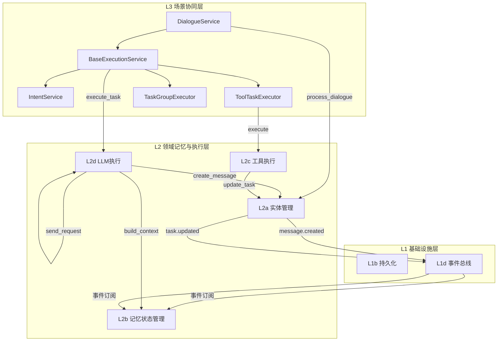
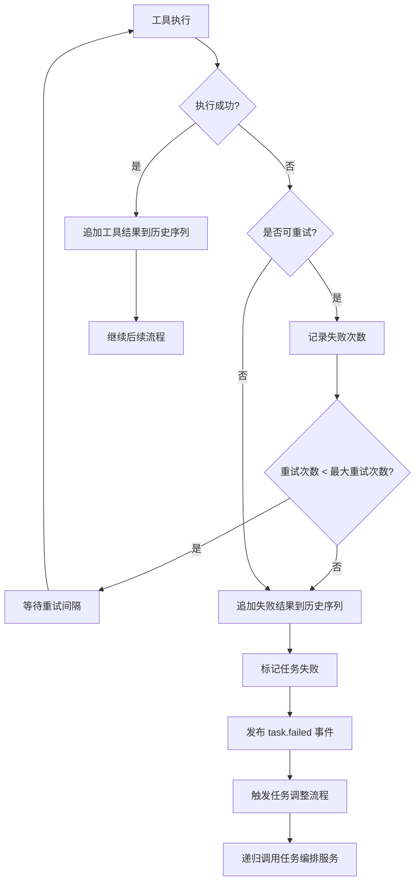
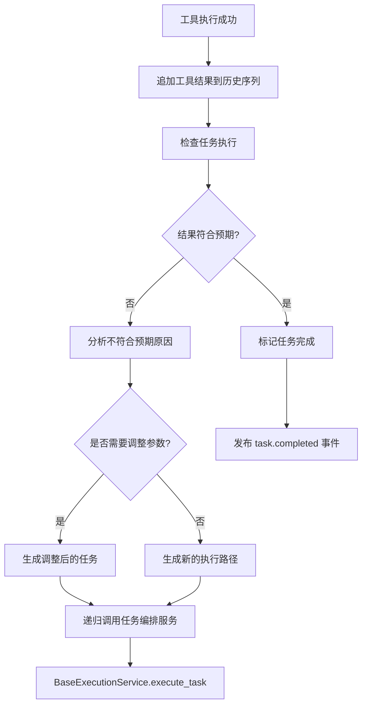

# 历史记忆添加流程设计

## 概述

本文档基于新的五层架构（v8.1），定义会话历史消息序列的构建和追加流程。历史记忆是LLM对话的上下文基础，通过事件驱动的方式逐步构建完整的消息序列。

---

## 1. 核心概念

### 1.1 历史消息序列结构

历史消息序列是一个有序的消息数组，用于构建LLM请求的上下文：

```python
class Message:
    role: str  # system, user, assistant, tool
    content: List[ContentBlock]  # 消息内容（数组结构）
    reasoning_content: Optional[str]  # Think信息（特殊字段）
    tool_calls: Optional[List[ToolCall]]  # 工具调用列表
    tool_call_id: Optional[str]  # 工具结果关联ID（tool角色时使用）

class ContentBlock:
    type: str  # "text"
    text: str  # 文本内容

class ToolCall:
    index: int  # 工具调用索引
    id: str  # 工具调用ID
    type: str  # "function"
    function: FunctionCall  # 函数调用

class FunctionCall:
    name: str  # 工具名称
    arguments: str  # JSON字符串格式的参数
```

> **与 llm_proxy_records.json 的对应关系**：
> - `content` 是数组，如 `[{"type": "text", "text": "..."}]`
> - `tool_calls` 的 `function.arguments` 是 JSON 字符串，不是对象
> - `tool` 角色的消息通过 `tool_call_id` 与 `tool_calls` 中的 `id` 关联

### 1.2 消息类型说明

| 消息类型 | 角色(role) | 说明 | 示例 |
|---------|-----------|------|-----|
| 系统提示 | system | 会话初始化时添加，包含系统指令和工具定义 | content: [{"type": "text", "text": "..."}] |
| 用户输入 | user | 用户文本输入 | content: [{"type": "text", "text": "帮我查询天气"}] |
| 助手响应 | assistant | LLM生成的文本响应 | content: [{"type": "text", "text": "好的..."}] |
| 思考过程 | assistant | LLM的内部思考 | reasoning_content: "我需要调用天气API..." |
| 工具调用 | assistant | 工具选择和参数 | tool_calls: [{index, id, function: {name, arguments}}] |
| 工具结果 | tool | 工具执行输出 | content: "结果...", tool_call_id: "call_xxx" |
| 任务上下文 | system | 任务元信息 | content: [{"type": "text", "text": '{"task_id": "xxx"}'}] |

---

## 2. 历史记忆添加流程

### 2.1 整体流程图



### 2.2 分阶段流程说明

#### 阶段1：会话初始化

```
L3c UI操作       L2a实体管理      L2b记忆管理      L1d事件总线
       |                |                |                |
       |--- 创建会话 ---->|                |                |
       |                |                |                |
       |                |--- 创建空序列 --->|                |
       |                |                |                |
       |                |--- 添加系统提示 -->|                |
       |                |                |                |
       |                |<-- 初始序列 ------|                |
       |                |                |                |
       |                |--- 发布事件 ------>|                |
       |                |                |                |
       |<-- 会话ID ------|                |                |
```

**关键操作**：
- L2a 创建Session实体
- L2b 初始化空消息序列
- L2b 添加系统提示消息（包含系统指令和工具定义）
- 发布 `session.created` 事件

#### 阶段2：用户输入

```
L5 UI层          L3a对话服务      L2a实体管理      L2b记忆管理      L1d事件总线
      |                |                |                |                |
      |--- 用户输入 ---->|                |                |                |
      |                |                |                |                |
      |                |--- 创建消息 ---->|                |                |
      |                |                |                |                |
      |                |                |--- 追加用户消息 -->|                |
      |                |                |                |                |
      |                |                |--- 发布事件 ------>|                |
      |                |                |                |                |
      |                |<-- 消息ID ------|                |                |
      |                |                |                |                |
      |<-- 响应 --------|                |                |                |
```

**关键操作**：
- L3a 接收用户输入
- L2a 创建Message实体（role=user）
- L2b 将用户消息追加到历史序列末尾
- 发布 `message.created` 事件

#### 阶段3：意图分析与LLM请求构建

```
L3a基础执行服务      L3a意图服务      L2d LLM执行      L2b记忆管理      L2a实体管理
            |                |                |                |                |
            |--- analyze_intent -->|                |                |                |
            |                |                |                |                |
            |                |--- 构建请求 ---->|                |                |
            |                |                |                |                |
            |                |                |--- 获取历史序列 -->|                |
            |                |                |                |                |
            |                |                |<-- messages数组 ----|                |
            |                |                |                |                |
            |                |                |--- 构建LLM请求 ----|                |
            |                |                |                |                |
            |                |                |--- 录制请求消息 -->|                |
            |                |                |                |                |
            |<-- 分析结果 ----|                |                |                |
```

**关键操作**：
- L3a 调用 IntentService 分析意图
- L2d 从 L2b 获取当前历史序列
- L2d 构建 messages 数组
- L2a 录制请求消息（用于审计）

#### 阶段4：LLM响应处理

```
L2d LLM执行      L1c LLM基础设施      L2a实体管理      L2b记忆管理      L1d事件总线
       |                |                |                |                |
       |--- 发送请求 ---->|                |                |                |
       |                |                |                |                |
       |<-- Chunk响应 ----|                |                |                |
       |                |                |                |                |
       |--- 解析Chunk ---->|                |                |                |
       |                |                |                |                |
       |--- 创建消息 ---->|                |                |                |
       |                |                |--- 追加消息 ---->|                |
       |                |                |                |                |
       |                |                |--- 发布事件 ------>|                |
       |                |                |                |                |
       |--- 继续接收 ---->|                |                |                |
```

**关键操作**：
- L2d 发送请求到 L1c
- 接收流式 Chunk 响应
- 解析 TextChunk 和 ThinkChunk
- L2a 创建 assistant 消息
- L2b 追加到历史序列

#### 阶段5：工具调用与结果处理

> **参考说明**：根据 `llm_proxy_records.json` 的实际数据结构：
> - 工具调用 (tool_calls) 包含 `index`、`id`、`type: "function"`、`function: {name, arguments}`，其中 arguments 是 JSON 字符串
> - 工具结果 role 为 "tool"，通过 `tool_call_id` 关联
> - 支持并行工具调用（一个 assistant 消息可包含多个 tool_call）

```
L2d LLM执行      L3a工具任务执行      L2c工具执行      L2a实体管理      L2b记忆管理
       |                |                |                |                |
       |--- 解析工具调用 -->|                |                |                |
       |                |                |                |                |
       |                |--- execute ---->|                |                |
       |                |                |                |                |
       |                |<-- 工具结果 ------|                |                |
       |                |                |                |                |
       |                |--- 更新任务 ---->|                |                |
       |                |                |                |                |
       |                |                |--- 追加tool消息 -->|                |
       |                |                |                |                |
       |<-- 工具结果 ------|                |                |                |
       |                |                |                |                |
       |--- 继续LLM调用 -->|                |                |                |
```

**关键操作**：
- L2d 解析 LLM 响应中的工具调用（tool_calls 数组）
- L3a 调用 ToolTaskExecutor 执行工具
- L2c 执行工具并返回结果
- L2a 更新任务状态
- L2b 追加 tool 消息（role: "tool", tool_call_id 关联）
- L2d 将工具结果加入上下文，继续调用 LLM

**并行工具调用**：
LLM 可能在一轮响应中同时发起多个工具调用，例如：
```json
{
  "role": "assistant",
  "content": [{"type": "text", "text": ""}],
  "tool_calls": [
    {"index": 0, "id": "call_001", "type": "function", "function": {"name": "LS", "arguments": "{\"path\":\"d:\\\\test\"}"}},
    {"index": 1, "id": "call_002", "type": "function", "function": {"name": "Glob", "arguments": "{\"pattern\":\"**/*.md\"}"}},
    {"index": 2, "id": "call_003", "type": "function", "function": {"name": "Grep", "arguments": "{\"pattern\":\"TODO\"}"}}
  ]
}
```

**工具结果返回**：
成功格式： 
```json
{
  "role": "tool",
  "content": "<toolcall_status>failed</toolcall_status>\n<toolcall_result>\n执行失败：文件路径不存在或权限不足\n</toolcall_result>",
  "tool_call_id": "call_3IjNPsVkqo6wEi2wCv8BhMEL"
}
```

失败格式：
```json
{
  "role": "tool",
  "content": "<toolcall_status>failed</toolcall_status>\n<toolcall_result>\n执行失败：文件路径不存在或权限不足\n</toolcall_result>",
  "tool_call_id": "call_3IjNPsVkqo6wEi2wCv8BhMEL"
}
```


#### 阶段6：任务执行上下文

```
L3a任务组执行      L3a任务执行服务      L2a实体管理      L2b记忆管理
            |                |                |                |
            |--- 创建任务组 -->|                |                |
            |                |                |                |
            |                |--- 创建任务 ---->|                |
            |                |                |                |
            |                |                |--- 追加任务上下文 -->|
            |                |                |                |
            |                |<-- 任务ID ------|                |
            |                |                |                |
            |<-- 任务组ID ----|                |                |
```

**关键操作**：
- L3a 创建 TaskGroup 和 Task 实体
- L2b 在历史序列中追加任务上下文消息（system(task)）

#### 阶段7：对话结束

```
L3a对话服务      L2a实体管理      L2b记忆管理      L1b持久化      L1d事件总线
       |                |                |                |                |
       |--- 结束对话 ---->|                |                |                |
       |                |                |                |                |
       |                |--- 保存序列 ---->|                |                |
       |                |                |                |                |
       |                |                |--- 持久化 -------->|                |
       |                |                |                |                |
       |                |--- 发布事件 ------>|                |                |
       |                |                |                |                |
       |<-- 完成 --------|                |                |                |
```

**关键操作**：
- L2b 保存完整消息序列
- L1b 持久化会话记录
- 发布 `conversation.ended` 事件

---

## 3. 消息序列追加规则

| 事件 | 触发组件 | 消息类型 | 角色 | 追加位置 | 说明 |
|-----|---------|---------|-----|---------|------|
| session.created | L2a | 系统提示 | system | 序列开头 | 包含系统指令和工具定义 |
| message.created(user) | L2a | 用户输入 | user | 序列末尾 | 用户文本输入（content 为数组） |
| text_chunk.received | L2d | 助手响应 | assistant | 序列末尾 | LLM文本输出（content 为数组） |
| think_chunk.received | L2d | 思考过程 | assistant | 序列末尾 | Think信息（reasoning_content 字段） |
| tool_selected | L2d | 工具调用 | assistant | 序列末尾 | 工具选择结果（tool_calls 数组） |
| tool_output.received | L2c | 工具结果 | tool | 工具调用后 | 工具执行输出（tool_call_id 关联） |
| task.created | L3a | 任务上下文 | system | 任务执行前 | 任务元信息 |
| conversation.ended | L3a | - | - | - | 持久化完整序列 |

---

## 3.1 各服务写入历史数据内容

| 服务名称 | 写入的数据类型 | 数据内容描述 | 触发时机 | 写入位置 |
|---------|--------------|-------------|---------|---------|
| **DialogueService** | 对话元信息 | 对话ID、会话ID、开始时间 | 对话开始 | 历史序列头部（系统消息） |
| **IntentService** | 意图分析结果 | 意图类型、置信度、执行路径 | 意图分析完成 | 历史序列（assistant消息的reasoning_content） |
| **BaseExecutionService** | 任务执行状态 | 任务ID、执行阶段、状态 | 任务状态变更 | 历史序列（task_context消息） |
| **ToolTaskExecutor** | 工具调用记录 | 工具名称、参数、执行状态 | 工具调用前后 | 历史序列（tool_call/tool_result消息） |
| **CheckTaskService** | 检查结果 | 检查类型、结果、原因分析 | 检查完成 | 历史序列（task_context消息） |
| **AdjustTaskService** | 调整策略 | 调整类型、策略、新任务参数 | 调整决策完成 | 历史序列（task_context消息） |
| **TaskGroupExecutor** | 任务组信息 | 任务组ID、子任务列表、执行模式 | 任务组创建/完成 | 历史序列（task_context消息） |
| **TaskExecutionService** | 任务执行记录 | 任务ID、名称、状态、结果 | 任务执行完成 | 历史序列（task_context消息） |
| **L2a 实体管理** | 消息实体 | 消息ID、角色、内容、类型 | 消息创建 | 历史序列（各类消息） |
| **L2b 记忆状态管理** | 记忆元数据 | 序列版本、压缩状态、记忆类型 | 序列更新 | 历史序列元数据 |
| **L2d LLM执行服务** | LLM响应 | 文本内容、思考内容、工具调用 | 收到Chunk响应 | 历史序列（assistant消息的 tool_calls 字段） |
| **L2c 工具执行服务** | 工具结果 | 工具名称、输出、执行时间 | 工具执行完成 | 历史序列（tool 消息，tool_call_id 关联） |

---

## 4. 四种场景的历史消息序列示例

根据不同的使用场景，历史消息序列的构建方式和复杂度有所不同。以下分别展示四种典型场景的消息序列结构。

> **参考说明**：以下示例参考 `llm_proxy_records.json` 的实际数据结构：
> - user 的 content 是数组：`[{"type": "text", "text": "..."}]`
> - tool_calls 结构：`[{index, id, type: "function", function: {name, arguments}}]`，arguments 是 JSON 字符串
> - 工具结果 role 为 "tool"，包含 tool_call_id

### 4.1 场景一：简单大模型对话

适用于纯粹的问答对话，无需工具调用和任务执行。

```json
[
  {
    "role": "system",
    "content": [
      {
        "type": "text",
        "text": "你是一个有帮助的AI助手，请根据用户的问题提供准确、简洁的回答。"
      }
    ]
  },
  {
    "role": "user",
    "content": [
      {
        "type": "text",
        "text": "什么是设计模式？"
      }
    ]
  },
  {
    "role": "assistant",
    "content": [
      {
        "type": "text",
        "text": "设计模式是软件工程中常见问题的可重用解决方案。它们是经过验证的编程经验，能帮助开发者解决常见的架构问题，提高代码的可维护性和复用性。常见的设计模式包括：单例模式、工厂模式、观察者模式、策略模式等。"
      }
    ]
  }
]
```

**特点**：
- 仅包含 system、user、assistant 三种角色
- user/assistant 的 content 是数组结构
- 无工具调用
- 无任务上下文

---

### 4.2 场景二：简单任务单工具调用

适用于需要执行单个工具的简单任务，如查询天气、读取文件等。

```json
[
  {
    "role": "system",
    "content": [
      {
        "type": "text",
        "text": "你是一个有帮助的AI助手，可用工具：[{name: 'weather', description: '查询天气'}]"
      }
    ]
  },
  {
    "role": "user",
    "content": [
      {
        "type": "text",
        "text": "今天北京天气怎么样？"
      }
    ]
  },
  {
    "role": "assistant",
    "content": [
      {
        "type": "text",
        "text": ""
      }
    ],
    "reasoning_content": "用户想查询北京今天的天气，我需要调用天气查询工具。",
    "tool_calls": [
      {
        "index": 0,
        "id": "call_abc123",
        "type": "function",
        "function": {
          "name": "weather",
          "arguments": "{\"city\": \"北京\", \"date\": \"today\"}"
        }
      }
    ]
  },
  {
    "role": "tool",
    "content": [{"type": "text", "text": "北京今天天气晴朗，温度15-25°C，适宜外出活动。"}],
    "tool_call_id": "call_abc123"
  },
  {
    "role": "assistant",
    "content": [
      {
        "type": "text",
        "text": "今天北京天气晴朗，温度15-25°C，非常适合外出活动！"
      }
    ]
  }
]
```

**特点**：
- tool_calls 包含 index、id、type、function 结构
- function.arguments 是 JSON 字符串格式
- 工具结果 role 为 "tool"，通过 tool_call_id 关联
- 无任务上下文

---

### 4.3 场景三：一层复杂任务组+工具

适用于包含多个子任务的复杂任务，每个子任务可能涉及工具调用。

```json
[
  {
    "role": "system",
    "content": [
      {
        "type": "text",
        "text": "你是一个有帮助的AI助手，可用工具：[{name: 'Read', description: '读取文件'}, {name: 'Write', description: '写入文件'}]"
      }
    ]
  },
  {
    "role": "user",
    "content": [
      {
        "type": "text",
        "text": "帮我把 /workspace/config.example.yaml 复制一份到 /workspace/config.yaml"
      }
    ]
  },
  {
    "role": "system",
    "content": [
      {
        "type": "text",
        "text": "{\"task_group_id\": \"tg-001\", \"task_group_name\": \"配置文件复制任务\", \"task_count\": 2}"
      }
    ]
  },
  {
    "role": "assistant",
    "content": [
      {
        "type": "text",
        "text": ""
      }
    ],
    "reasoning_content": "用户需要复制配置文件，这是一个包含两个子任务的任务组：1) 读取源文件 2) 写入目标文件。"
  },
  {
    "role": "system",
    "content": [
      {
        "type": "text",
        "text": "{\"task_group_id\": \"tg-001\", \"task_id\": \"task-001\", \"task_name\": \"读取源文件\", \"status\": \"pending\"}"
      }
    ]
  },
  {
    "role": "assistant",
    "content": [
      {
        "type": "text",
        "text": ""
      }
    ],
    "tool_calls": [
      {
        "index": 0,
        "id": "call_read_001",
        "type": "function",
        "function": {
          "name": "Read",
          "arguments": "{\"path\": \"/workspace/config.example.yaml\"}"
        }
      }
    ]
  },
  {
    "role": "tool",
    "content": [{"type": "text", "text": "database:\n  host: localhost\n  port: 5432\nusername: admin\npassword: secret"}],
    "tool_call_id": "call_read_001"
  },
  {
    "role": "system",
    "content": [
      {
        "type": "text",
        "text": "{\"task_group_id\": \"tg-001\", \"task_id\": \"task-001\", \"task_name\": \"读取源文件\", \"status\": \"completed\"}"
      }
    ]
  },
  {
    "role": "system",
    "content": [
      {
        "type": "text",
        "text": "{\"task_group_id\": \"tg-001\", \"task_id\": \"task-002\", \"task_name\": \"写入目标文件\", \"status\": \"pending\"}"
      }
    ]
  },
  {
    "role": "assistant",
    "content": [
      {
        "type": "text",
        "text": ""
      }
    ],
    "tool_calls": [
      {
        "index": 0,
        "id": "call_write_001",
        "type": "function",
        "function": {
          "name": "Write",
          "arguments": "{\"path\": \"/workspace/config.yaml\", \"content\": \"database:\\n  host: localhost\\n  port: 5432\\nusername: admin\\npassword: secret\"}"
        }
      }
    ]
  },
  {
    "role": "tool",
    "content": [{"type": "text", "text": "文件写入成功"}],
    "tool_call_id": "call_write_001"
  },
  {
    "role": "system",
    "content": [
      {
        "type": "text",
        "text": "{\"task_group_id\": \"tg-001\", \"task_id\": \"task-002\", \"task_name\": \"写入目标文件\", \"status\": \"completed\"}"
      }
    ]
  },
  {
    "role": "system",
    "content": [
      {
        "type": "text",
        "text": "{\"task_group_id\": \"tg-001\", \"task_group_name\": \"配置文件复制任务\", \"status\": \"completed\", \"completed_count\": 2}"
      }
    ]
  },
  {
    "role": "assistant",
    "content": [
      {
        "type": "text",
        "text": "已完成配置文件复制。源文件 /workspace/config.example.yaml 的内容已成功复制到 /workspace/config.yaml。"
      }
    ]
  }
]
```

**特点**：
- 任务组级别上下文（task_context）
- 每个子任务有独立的 task_context
- 包含 pending 和 completed 状态
- 多个工具调用按顺序执行
- 工具结果通过 tool_call_id 关联

---

### 4.4 场景四：多层嵌套任务组+工具

适用于复杂的嵌套任务，如同时处理多个文件、执行代码、验证结果等多层嵌套场景。

```json
[
  {
    "role": "system",
    "content": [
      {
        "type": "text",
        "text": "你是一个有帮助的AI助手，可用工具：[{name: 'Read', description: '读取文件'}, {name: 'Write', description: '写入文件'}, {name: 'Execute', description: '执行代码'}]"
      }
    ]
  },
  {
    "role": "user",
    "content": [
      {
        "type": "text",
        "text": "帮我完成以下任务：1) 读取 config.yaml 获取数据库配置 2) 根据配置执行数据库连接测试 3) 将测试结果写入 result.txt"
      }
    ]
  },
  {
    "role": "system",
    "content": [
      {
        "type": "text",
        "text": "{\"task_group_id\": \"tg-001\", \"task_group_name\": \"数据库配置验证任务\", \"task_count\": 3, \"layer\": 1}"
      }
    ]
  },
  {
    "role": "assistant",
    "content": [
      {
        "type": "text",
        "text": ""
      }
    ],
    "reasoning_content": "用户需要完成一个三层嵌套任务：1) 读取配置文件 2) 执行数据库连接测试 3) 写入结果。这是一个典型的多层任务组，需要按顺序执行。"
  },
  {
    "role": "system",
    "content": [
      {
        "type": "text",
        "text": "{\"task_group_id\": \"tg-001\", \"task_id\": \"task-001\", \"task_name\": \"读取配置文件\", \"layer\": 2, \"status\": \"pending\"}"
      }
    ]
  },
  {
    "role": "assistant",
    "content": [
      {
        "type": "text",
        "text": ""
      }
    ],
    "tool_calls": [
      {
        "index": 0,
        "id": "call_read_001",
        "type": "function",
        "function": {
          "name": "Read",
          "arguments": "{\"path\": \"/workspace/config.yaml\"}"
        }
      }
    ]
  },
  {
    "role": "tool",
    "content": [{"type": "text", "text": "host: localhost\nport: 5432\ndatabase: testdb\nusername: admin\npassword: secret"}],
    "tool_call_id": "call_read_001"
  },
  {
    "role": "system",
    "content": [
      {
        "type": "text",
        "text": "{\"task_group_id\": \"tg-001\", \"task_id\": \"task-001\", \"task_name\": \"读取配置文件\", \"layer\": 2, \"status\": \"completed\", \"result\": \"配置读取成功\"}"
      }
    ]
  },
  {
    "role": "system",
    "content": [
      {
        "type": "text",
        "text": "{\"task_group_id\": \"tg-001\", \"task_id\": \"task-002\", \"task_name\": \"执行数据库连接测试\", \"layer\": 2, \"parent_task_id\": \"task-001\", \"status\": \"pending\"}"
      }
    ]
  },
  {
    "role": "assistant",
    "content": [
      {
        "type": "text",
        "text": ""
      }
    ],
    "tool_calls": [
      {
        "index": 0,
        "id": "call_exec_001",
        "type": "function",
        "function": {
          "name": "Execute",
          "arguments": "{\"code\": \"python3 test_db_connection.py\", \"timeout\": 30}"
        }
      }
    ]
  },
  {
    "role": "tool",
    "content": [{"type": "text", "text": "数据库连接成功！\n- Host: localhost\n- Port: 5432\n- Database: testdb\n- Status: Connected"}],
    "tool_call_id": "call_exec_001"
  },
  {
    "role": "system",
    "content": [
      {
        "type": "text",
        "text": "{\"task_group_id\": \"tg-001\", \"task_id\": \"task-002\", \"task_name\": \"执行数据库连接测试\", \"layer\": 2, \"status\": \"completed\", \"result\": \"连接成功\"}"
      }
    ]
  },
  {
    "role": "system",
    "content": [
      {
        "type": "text",
        "text": "{\"task_group_id\": \"tg-001\", \"task_id\": \"task-003\", \"task_name\": \"写入测试结果\", \"layer\": 2, \"status\": \"pending\"}"
      }
    ]
  },
  {
    "role": "assistant",
    "content": [
      {
        "type": "text",
        "text": ""
      }
    ],
    "tool_calls": [
      {
        "index": 0,
        "id": "call_write_001",
        "type": "function",
        "function": {
          "name": "Write",
          "arguments": "{\"path\": \"/workspace/result.txt\", \"content\": \"数据库连接测试结果\\n==================\\n测试时间: 2026-05-18\\n主机: localhost\\n端口: 5432\\n数据库: testdb\\n状态: 连接成功\"}"
        }
      }
    ]
  },
  {
    "role": "tool",
    "content": [{"type": "text", "text": "文件写入成功"}],
    "tool_call_id": "call_write_001"
  },
  {
    "role": "system",
    "content": [
      {
        "type": "text",
        "text": "{\"task_group_id\": \"tg-001\", \"task_id\": \"task-003\", \"task_name\": \"写入测试结果\", \"layer\": 2, \"status\": \"completed\", \"result\": \"结果已保存\"}"
      }
    ]
  },
  {
    "role": "system",
    "content": [
      {
        "type": "text",
        "text": "{\"task_group_id\": \"tg-001\", \"task_group_name\": \"数据库配置验证任务\", \"layer\": 1, \"status\": \"completed\", \"completed_count\": 3, \"total_count\": 3}"
      }
    ]
  },
  {
    "role": "assistant",
    "content": [
      {
        "type": "text",
        "text": "已完成任务！\n1. 成功读取配置文件\n2. 数据库连接测试通过\n3. 测试结果已保存到 result.txt"
      }
    ]
  }
]
```

**特点**：
- 多层任务组结构（layer 1 为顶层任务组，layer 2 为子任务）
- 嵌套任务依赖关系（task-002 依赖 task-001 的结果）
- 每个任务有独立的上下文信息
- 完整的任务执行状态追踪
- 最终汇总报告

---

## 5. 与新架构的对应关系

### 5.1 分层职责映射

| 层级 | 组件 | 职责 |
|-----|------|------|
| L5 | UI应用层 | 用户输入接收、消息展示 |
| L4 | 网关层 | 协议适配、WebSocket推送 |
| L3a | DialogueService | 对话生命周期管理 |
| L3a | BaseExecutionService | 任务编排、路由分发 |
| L3a | IntentService | 意图分析、路径选择 |
| L3a | ToolTaskExecutor | 工具任务执行协调 |
| L3a | TaskGroupExecutor | 任务组调度 |
| L2a | 实体管理 | Message/Session/Task持久化 |
| L2b | 记忆状态管理 | 历史序列构建、短期/长期记忆 |
| L2d | LLM执行 | 请求构建、响应解析、流式处理 |
| L2c | 工具执行 | 工具调用、结果处理 |
| L1b | 持久化 | 数据存储 |
| L1d | 事件总线 | 事件发布订阅 |

### 5.2 核心调用链

```
用户输入 → L5 → L4 → L3a.DialogueService → L2a.create_message()
                                                  ↓
                                           L1d.publish(message.created)
                                                  ↓
                                           L2b.on_message_created() → 追加到历史序列
                                                  ↓
                                           L3a.BaseExecutionService.execute_task()
                                                  ↓
                                           L3a.IntentService.analyze_intent()
                                                  ↓
                                           L2d.build_context() → L2b.get_history()
                                                  ↓
                                           L2d.send_request() → L1c
                                                  ↓
                                           L2d.on_chunk_received() → L2a.create_message()
                                                  ↓
                                           L2b.append_to_history()
                                                  ↓
                                           L1d.publish(message.updated)
                                                  ↓
                                           L5.update_ui()
```

---

## 6. 容错与恢复

### 6.1 消息丢失处理

- 使用事件总线确保消息不丢失
- 消息追加采用幂等设计
- 支持消息重放机制

### 6.2 序列一致性保障

- 使用事务确保序列完整性
- 消息追加顺序通过时间戳保证
- 支持序列版本控制

### 6.3 异常恢复

- 网络中断时缓存未持久化消息
- 服务重启后恢复未完成的序列
- 支持断点续传

---

## 7. 性能优化

### 7.1 序列压缩策略

- 长期记忆采用摘要压缩
- 短期记忆保持完整
- 支持序列分段加载

### 7.2 缓存机制

- 活跃会话序列缓存
- 历史序列按需加载
- 工具定义缓存

### 7.3 异步处理

- 消息追加异步执行
- 持久化异步写入
- 事件发布异步推送

---

## 8. 工具执行异常处理流程

### 8.1 工具执行失败处理

当工具执行失败时，系统需要进行错误处理和重试机制：



#### 处理步骤

| 步骤 | 组件 | 操作 |
|-----|------|------|
| 1 | L2c | 执行工具调用 |
| 2 | L2c | 检查执行结果状态 |
| 3 | L2c | 判断是否可重试（网络错误、超时等可重试，参数错误不可重试） |
| 4 | L3a | 记录失败次数，检查重试阈值 |
| 5 | L3a | 达到阈值则追加失败结果到历史序列 |
| 6 | L3a | 触发任务调整流程 |
| 7 | L3a | 递归调用 BaseExecutionService.execute_task() |

#### 失败结果消息格式

```json
{
  "role": "tool_result",
  "name": "weather",
  "content": "工具执行失败：网络超时",
  "type": "tool_result",
  "error": {
    "code": "NETWORK_TIMEOUT",
    "message": "网络超时，请稍后重试",
    "retry_count": 3,
    "max_retries": 3
  },
  "success": false
}
```

### 8.2 工具执行成功但检查任务不符合预期处理

当工具执行成功但检查任务发现结果不符合预期时，需要触发任务调整流程：



#### 处理步骤

| 步骤 | 组件 | 操作 |
|-----|------|------|
| 1 | L2c | 工具执行成功，追加结果到历史序列 |
| 2 | L3a.CheckTaskService | 检查任务执行结果 |
| 3 | L3a.CheckTaskService | 判断结果是否符合预期 |
| 4 | L3a.AdjustTaskService | 分析不符合预期的原因 |
| 5 | L3a.AdjustTaskService | 决定是否调整参数或生成新路径 |
| 6 | L3a | 创建调整后的任务或新任务 |
| 7 | L3a | 递归调用 BaseExecutionService.execute_task() |

#### 检查任务服务设计

```python
class CheckTaskService:
    def __init__(self):
        self.base_executor = BaseExecutionService()
    
    def execute(self, task: Task) -> CheckResult:
        """
        检查任务执行结果是否符合预期
        """
        # 1. 获取工具执行结果
        tool_result = self._get_last_tool_result(task)
        
        # 2. 分析结果是否符合预期
        is_expected = self._analyze_result(task, tool_result)
        
        if not is_expected:
            # 3. 创建检查子任务
            check_task = Task(
                task_id=f"{task.task_id}_check",
                parent_task_id=task.task_id,
                input_data={
                    "original_task": task,
                    "tool_result": tool_result,
                    "check_type": "validation"
                }
            )
            # 4. 递归调用基础执行服务进行调整
            return self.base_executor.execute_task(check_task)
        
        return CheckResult(status="PASS", message="结果符合预期")
```

#### 任务调整服务设计

```python
class AdjustTaskService:
    def __init__(self):
        self.base_executor = BaseExecutionService()
    
    def execute(self, task: Task, check_result: CheckResult) -> AdjustResult:
        """
        根据检查结果调整任务执行策略
        """
        # 1. 分析不符合预期的原因
        reason = self._analyze_failure_reason(check_result)
        
        # 2. 决定调整策略
        adjustment_strategy = self._determine_strategy(task, reason)
        
        # 3. 创建调整子任务
        adjust_task = Task(
            task_id=f"{task.task_id}_adjust",
            parent_task_id=task.task_id,
            input_data={
                "original_task": task,
                "check_result": check_result,
                "strategy": adjustment_strategy
            }
        )
        
        # 4. 递归调用基础执行服务执行调整任务
        return self.base_executor.execute_task(adjust_task)
    
    def _determine_strategy(self, task: Task, reason: str) -> str:
        """
        根据失败原因决定调整策略
        """
        if "参数错误" in reason:
            return "ADJUST_PARAMETERS"
        elif "数据不足" in reason:
            return "REQUEST_MORE_INFO"
        elif "工具不适用" in reason:
            return "SWITCH_TOOL"
        elif "结果不完整" in reason:
            return "CONTINUE_EXECUTION"
        else:
            return "RETRY_WITH_CORRECTION"
```

### 8.3 递归调用机制

工具执行失败或检查任务不符合预期时，通过递归调用机制实现自我修正：

```
用户请求
    │
    ↓
BaseExecutionService.execute_task(task1)
    │
    ├──→ IntentService.analyze_intent()
    │
    ├──→ ToolTaskExecutor.execute(task1)
    │       │
    │       ├──→ L2c.execute_tool()
    │       │       │
    │       │       └──→ 工具执行失败
    │       │               │
    │       │               ↓
    │       └──→ CheckTaskService.execute(check_task)
    │                       │
    │                       ↓
    │               BaseExecutionService.execute_task(check_task)
    │                       │
    │                       ├──→ IntentService.analyze_intent()
    │                       │
    │                       └──→ ... (继续递归处理)
    │
    └──→ 返回最终结果
```

### 8.4 调整后的历史序列示例

当工具执行失败并触发调整流程时，历史序列会包含调整过程：

```json
[
  {"role": "system", "content": "系统提示..."},
  {"role": "user", "content": "查询北京天气"},
  {"role": "assistant", "content": "", "tool_calls": [{"name": "weather", "parameters": {"city": "北京"}}], "type": "tool_call"},
  {"role": "tool_result", "name": "weather", "content": "网络超时", "success": false, "type": "tool_result"},
  {"role": "system", "content": "{\"task_id\": \"xxx_check\", \"type\": \"validation\", \"result\": \"不符合预期\"}", "type": "task_context"},
  {"role": "assistant", "content": "工具执行失败，正在重试...", "type": "text"},
  {"role": "assistant", "content": "", "tool_calls": [{"name": "weather", "parameters": {"city": "北京"}}], "type": "tool_call"},
  {"role": "tool_result", "name": "weather", "content": "北京天气晴朗，25°C", "success": true, "type": "tool_result"},
  {"role": "assistant", "content": "北京今天天气晴朗，温度25°C", "type": "text"}
]
```

---

## 9. 状态管理与恢复

### 9.1 任务状态流转

| 当前状态 | 触发事件 | 下一状态 | 说明 |
|---------|---------|---------|------|
| PENDING | 开始执行 | EXECUTING | 任务开始执行 |
| EXECUTING | 工具执行成功 | CHECKING | 进入检查阶段 |
| EXECUTING | 工具执行失败 | RETRYING | 进入重试阶段 |
| CHECKING | 结果符合预期 | COMPLETED | 任务完成 |
| CHECKING | 结果不符合预期 | ADJUSTING | 进入调整阶段 |
| RETRYING | 重试成功 | CHECKING | 继续检查 |
| RETRYING | 重试失败 | FAILED | 任务失败 |
| ADJUSTING | 调整完成 | EXECUTING | 重新执行 |
| ADJUSTING | 无法调整 | FAILED | 任务失败 |

### 9.2 异常恢复策略

| 异常类型 | 恢复策略 | 最大重试次数 | 重试间隔 |
|---------|---------|-------------|---------|
| 网络超时 | 立即重试 | 3 | 1s, 2s, 4s (指数退避) |
| API限流 | 等待后重试 | 3 | 5s, 10s, 15s |
| 参数错误 | 不重试，触发调整 | 0 | - |
| 工具不存在 | 不重试，切换工具 | 0 | - |
| 结果不符合预期 | 触发调整流程 | - | - |