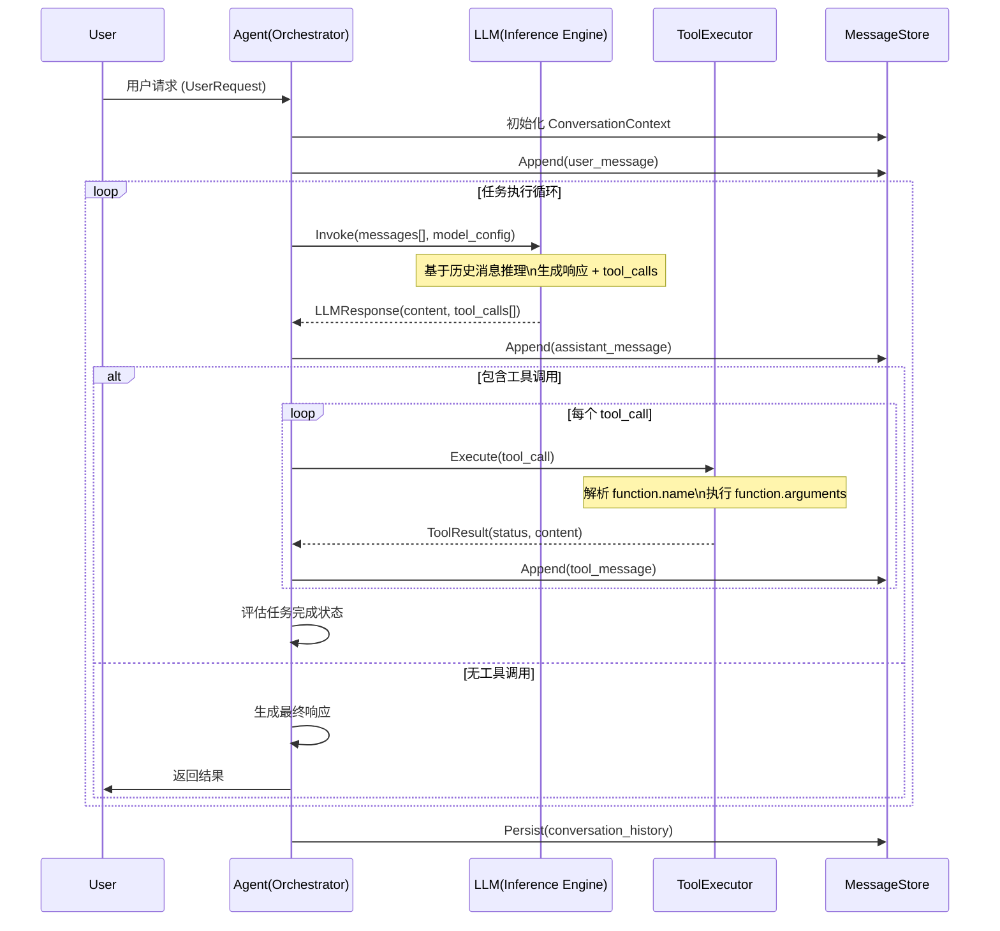
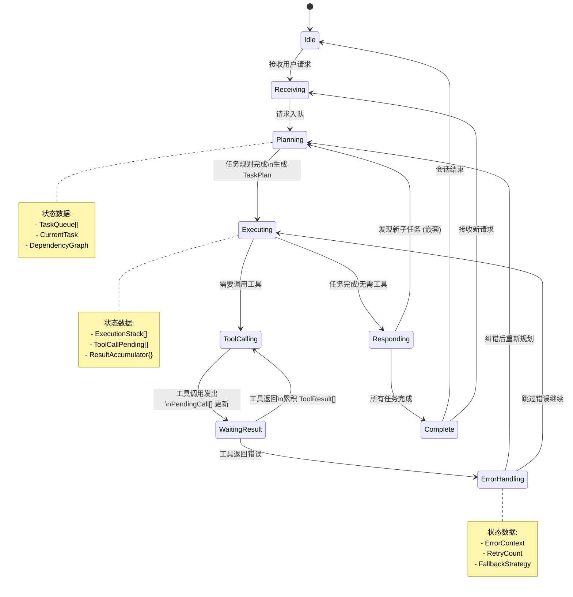
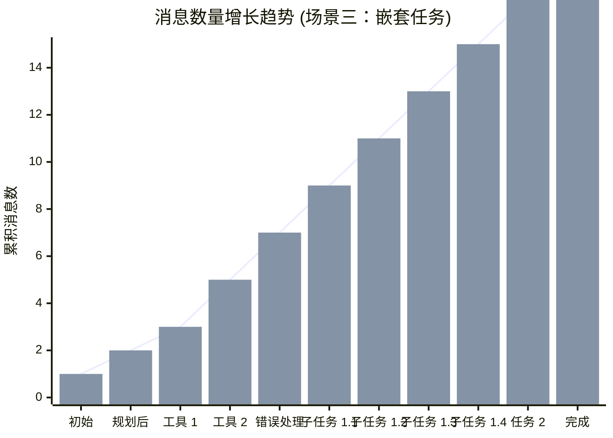
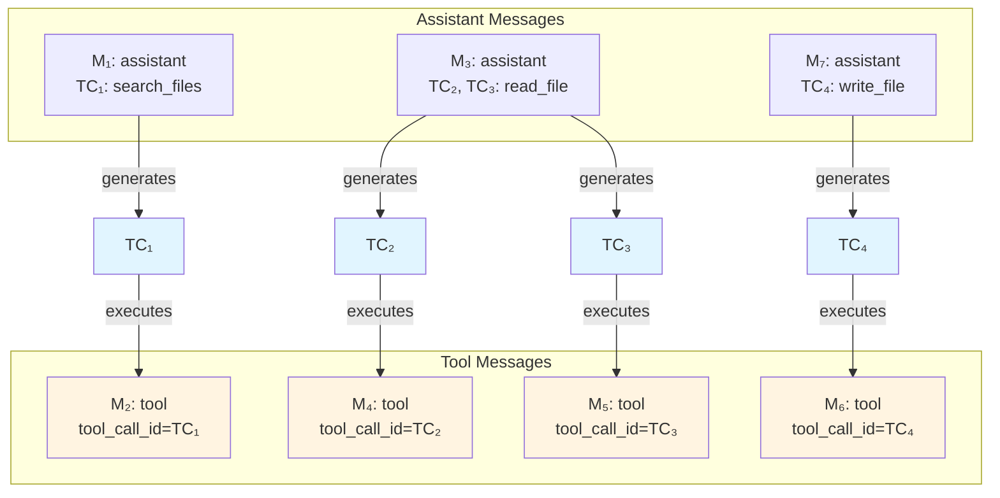
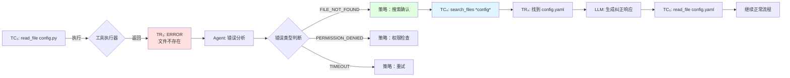

# Agent 调用大模型 - 历史对话消息示例

本文档展示 Agent 调用大模型时，采用 message 数组携带历史对话消息的几个典型场景示例。

---

## 场景一：多任务多工具逐一执行

用户输入被划分为多个任务，每个任务需要调用多个工具，按顺序执行完成。

### 示例：用户请求"帮我分析项目代码结构，生成文档，并创建测试计划"

```json
{
  "messages": [
    {
      "role": "user",
      "content": "帮我分析项目代码结构，生成文档，并创建测试计划"
    },
    {
      "role": "assistant",
      "content": "我将分三个任务完成您的请求：\n1. 分析项目代码结构\n2. 生成项目文档\n3. 创建测试计划\n\n开始执行任务1：分析项目代码结构",
      "tool_calls": [
        {
          "id": "call_001",
          "type": "function",
          "function": {
            "name": "search_files",
            "arguments": "{\"pattern\": \"*.py\", \"target\": \"files\"}"
          }
        }
      ]
    },
    {
      "role": "tool",
      "tool_call_id": "call_001",
      "content": "{\"matches\": [\"/src/main.py\", \"/src/utils.py\", \"/src/api.py\", \"/tests/test_main.py\"]}"
    },
    {
      "role": "assistant",
      "content": "发现4个Python文件。继续分析文件内容结构。",
      "tool_calls": [
        {
          "id": "call_002",
          "type": "function",
          "function": {
            "name": "read_file",
            "arguments": "{\"path\": \"/src/main.py\"}"
          }
        },
        {
          "id": "call_003",
          "type": "function",
          "function": {
            "name": "read_file",
            "arguments": "{\"path\": \"/src/utils.py\"}"
          }
        }
      ]
    },
    {
      "role": "tool",
      "tool_call_id": "call_002",
      "content": "文件内容：def main(): ... (省略)"
    },
    {
      "role": "tool",
      "tool_call_id": "call_003",
      "content": "文件内容：def helper(): ... (省略)"
    },
    {
      "role": "assistant",
      "content": "任务1完成。项目结构：main.py(入口), utils.py(工具函数), api.py(API接口)。\n\n开始执行任务2：生成项目文档",
      "tool_calls": [
        {
          "id": "call_004",
          "type": "function",
          "function": {
            "name": "write_file",
            "arguments": "{\"path\": \"/docs/README.md\", \"content\": \"# 项目文档...\"}"
          }
        }
      ]
    },
    {
      "role": "tool",
      "tool_call_id": "call_004",
      "content": "文件写入成功"
    },
    {
      "role": "assistant",
      "content": "任务2完成。文档已生成。\n\n开始执行任务3：创建测试计划",
      "tool_calls": [
        {
          "id": "call_005",
          "type": "function",
          "function": {
            "name": "write_file",
            "arguments": "{\"path\": \"/docs/test_plan.md\", \"content\": \"# 测试计划...\"}"
          }
        }
      ]
    },
    {
      "role": "tool",
      "tool_call_id": "call_005",
      "content": "文件写入成功"
    },
    {
      "role": "assistant",
      "content": "所有任务完成！\n- 任务1：代码结构分析完成\n- 任务2：项目文档生成完成\n- 任务3：测试计划创建完成"
    }
  ]
}
```

---

## 场景二：工具失败后大模型纠错

在场景一的基础上，某个工具调用失败，大模型识别错误并尝试纠正。

### 示例：读取文件时文件不存在，大模型重新尝试

```json
{
  "messages": [
    {
      "role": "user",
      "content": "帮我分析项目代码结构，生成文档，并创建测试计划"
    },
    {
      "role": "assistant",
      "content": "我将分三个任务完成您的请求：\n1. 分析项目代码结构\n2. 生成项目文档\n3. 创建测试计划\n\n开始执行任务1：分析项目代码结构",
      "tool_calls": [
        {
          "id": "call_001",
          "type": "function",
          "function": {
            "name": "search_files",
            "arguments": "{\"pattern\": \"*.py\", \"target\": \"files\"}"
          }
        }
      ]
    },
    {
      "role": "tool",
      "tool_call_id": "call_001",
      "content": "{\"matches\": [\"/src/main.py\", \"/src/utils.py\", \"/src/api.py\"]}"
    },
    {
      "role": "assistant",
      "content": "发现3个Python文件。继续分析文件内容结构。",
      "tool_calls": [
        {
          "id": "call_002",
          "type": "function",
          "function": {
            "name": "read_file",
            "arguments": "{\"path\": \"/src/main.py\"}"
          }
        },
        {
          "id": "call_003",
          "type": "function",
          "function": {
            "name": "read_file",
            "arguments": "{\"path\": \"/src/config.py\"}"
          }
        }
      ]
    },
    {
      "role": "tool",
      "tool_call_id": "call_002",
      "content": "文件内容：def main(): ..."
    },
    {
      "role": "tool",
      "tool_call_id": "call_003",
      "content": "ERROR: 文件不存在 - /src/config.py"
    },
    {
      "role": "assistant",
      "content": "检测到错误：config.py 文件不存在。可能是文件路径有误或文件已被删除。\n\n纠错策略：\n1. 重新搜索确认文件是否存在\n2. 如果确实不存在，跳过该文件继续分析其他文件",
      "tool_calls": [
        {
          "id": "call_004",
          "type": "function",
          "function": {
            "name": "search_files",
            "arguments": "{\"pattern\": \"*config*\", \"target\": \"files\"}"
          }
        }
      ]
    },
    {
      "role": "tool",
      "tool_call_id": "call_004",
      "content": "{\"matches\": [\"/src/config.yaml\", \"/tests/test_config.py\"]}"
    },
    {
      "role": "assistant",
      "content": "发现 config.py 确实不存在，但存在 config.yaml 配置文件。可能是配置文件使用了 YAML 格式而非 Python 格式。\n\n继续分析其他文件：",
      "tool_calls": [
        {
          "id": "call_005",
          "type": "function",
          "function": {
            "name": "read_file",
            "arguments": "{\"path\": \"/src/utils.py\"}"
          }
        },
        {
          "id": "call_006",
          "type": "function",
          "function": {
            "name": "read_file",
            "arguments": "{\"path\": \"/src/api.py\"}"
          }
        }
      ]
    },
    {
      "role": "tool",
      "tool_call_id": "call_005",
      "content": "文件内容：def helper(): ..."
    },
    {
      "role": "tool",
      "tool_call_id": "call_006",
      "content": "文件内容：class API: ..."
    },
    {
      "role": "assistant",
      "content": "任务1完成（已处理文件不存在的情况）。\n项目结构：main.py(入口), utils.py(工具函数), api.py(API接口), config.yaml(配置)。\n\n继续执行任务2和任务3...",
      "tool_calls": [
        {
          "id": "call_007",
          "type": "function",
          "function": {
            "name": "write_file",
            "arguments": "{\"path\": \"/docs/README.md\", \"content\": \"# 项目文档...\"}"
          }
        }
      ]
    }
  ]
}
```

---

## 场景三：嵌套任务划分

用户输入被划分为多个任务，在执行某个任务时，大模型发现该任务复杂度较高，进一步划分为子任务，形成嵌套结构。

### 示例：用户请求"帮我重构项目并优化性能"

```json
{
  "messages": [
    {
      "role": "user",
      "content": "帮我重构项目并优化性能"
    },
    {
      "role": "assistant",
      "content": "我将分两个主要任务完成您的请求：\n1. 重构项目代码\n2. 优化项目性能\n\n开始执行任务1：重构项目代码",
      "tool_calls": [
        {
          "id": "call_001",
          "type": "function",
          "function": {
            "name": "search_files",
            "arguments": "{\"pattern\": \"*.py\", \"target\": \"files\"}"
          }
        }
      ]
    },
    {
      "role": "tool",
      "tool_call_id": "call_001",
      "content": "{\"matches\": [\"/src/main.py\", \"/src/utils.py\", \"/src/api.py\", \"/src/models.py\", \"/src/services.py\"]}"
    },
    {
      "role": "assistant",
      "content": "发现5个Python文件。任务1（重构项目代码）较为复杂，需要进一步划分为子任务：\n\n子任务1.1：代码质量分析\n子任务1.2：识别重构点\n子任务1.3：执行重构\n子任务1.4：验证重构结果\n\n开始执行子任务1.1：代码质量分析",
      "tool_calls": [
        {
          "id": "call_002",
          "type": "function",
          "function": {
            "name": "read_file",
            "arguments": "{\"path\": \"/src/main.py\"}"
          }
        },
        {
          "id": "call_003",
          "type": "function",
          "function": {
            "name": "read_file",
            "arguments": "{\"path\": \"/src/utils.py\"}"
          }
        }
      ]
    },
    {
      "role": "tool",
      "tool_call_id": "call_002",
      "content": "文件内容：(500行代码，存在重复逻辑和长函数)"
    },
    {
      "role": "tool",
      "tool_call_id": "call_003",
      "content": "文件内容：(200行代码，存在未使用的导入)"
    },
    {
      "role": "assistant",
      "content": "子任务1.1完成。发现以下问题：\n- main.py: 存在重复逻辑，函数过长\n- utils.py: 存在未使用的导入\n\n开始执行子任务1.2：识别重构点",
      "tool_calls": [
        {
          "id": "call_004",
          "type": "function",
          "function": {
            "name": "terminal",
            "arguments": "{\"command\": \"pylint /src/main.py --errors-only\"}"
          }
        }
      ]
    },
    {
      "role": "tool",
      "tool_call_id": "call_004",
      "content": "E0101: Return outside function (line 45)\nE1101: Module 'utils' has no 'helper' member (line 78)"
    },
    {
      "role": "assistant",
      "content": "子任务1.2完成。识别出以下重构点：\n1. main.py line 45: return 语句在函数外\n2. main.py line 78: 调用不存在的 utils.helper\n\n开始执行子任务1.3：执行重构",
      "tool_calls": [
        {
          "id": "call_005",
          "type": "function",
          "function": {
            "name": "read_file",
            "arguments": "{\"path\": \"/src/main.py\", \"offset\": 40, \"limit\": 50}"
          }
        }
      ]
    },
    {
      "role": "tool",
      "tool_call_id": "call_005",
      "content": "文件内容片段：(显示问题代码)"
    },
    {
      "role": "assistant",
      "content": "分析代码后，执行修复：",
      "tool_calls": [
        {
          "id": "call_006",
          "type": "function",
          "function": {
            "name": "patch",
            "arguments": "{\"path\": \"/src/main.py\", \"old_string\": \"...\", \"new_string\": \"...\"}"
          }
        }
      ]
    },
    {
      "role": "tool",
      "tool_call_id": "call_006",
      "content": "补丁应用成功"
    },
    {
      "role": "assistant",
      "content": "子任务1.3完成。开始执行子任务1.4：验证重构结果",
      "tool_calls": [
        {
          "id": "call_007",
          "type": "function",
          "function": {
            "name": "terminal",
            "arguments": "{\"command\": \"python -m pytest /tests/ -v\"}"
          }
        }
      ]
    },
    {
      "role": "tool",
      "tool_call_id": "call_007",
      "content": "15 passed in 2.3s"
    },
    {
      "role": "assistant",
      "content": "子任务1.4完成。所有测试通过，重构验证成功。\n\n任务1（重构项目代码）全部完成！\n\n现在开始执行任务2：优化项目性能",
      "tool_calls": [
        {
          "id": "call_008",
          "type": "function",
          "function": {
            "name": "terminal",
            "arguments": "{\"command\": \"python -m cProfile /src/main.py\"}"
          }
        }
      ]
    },
    {
      "role": "tool",
      "tool_call_id": "call_008",
      "content": "性能分析结果：(显示热点函数)"
    },
    {
      "role": "assistant",
      "content": "任务2进行中...（性能优化）",
      "tool_calls": [
        {
          "id": "call_009",
          "type": "function",
          "function": {
            "name": "patch",
            "arguments": "{\"path\": \"/src/utils.py\", \"old_string\": \"...\", \"new_string\": \"(优化版本)...\"}"
          }
        }
      ]
    },
    {
      "role": "tool",
      "tool_call_id": "call_009",
      "content": "补丁应用成功"
    },
    {
      "role": "assistant",
      "content": "所有任务完成！\n- 任务1：项目重构完成（4个子任务全部通过）\n- 任务2：性能优化完成\n\n重构和性能优化已全部完成。"
    }
  ]
}
```

---

## 消息格式说明

### role 类型

| role | 说明 |
|------|------|
| `user` | 用户输入的消息 |
| `assistant` | 大模型的回复，可包含 `tool_calls` |
| `tool` | 工具调用的返回结果，通过 `tool_call_id` 关联 |

### 关键字段

- `tool_calls`: assistant 角色中携带的工具调用数组
- `tool_call_id`: tool 角色中关联对应的工具调用
- `id`: 每个工具调用的唯一标识符
- `function.name`: 调用的工具函数名
- `function.arguments`: 工具函数的参数（JSON 字符串）

---

## 使用建议

1. **保持消息完整性**: 历史消息数组应包含从对话开始到当前的所有消息，确保大模型有完整的上下文
2. **工具调用关联**: 确保 `tool_call_id` 与对应的 `tool_calls[].id` 精确匹配
3. **错误处理**: 工具返回错误时，在 assistant 消息中明确说明错误原因和纠正策略
4. **任务追踪**: 在复杂任务中，明确标注当前执行的任务/子任务层级，便于追踪进度
5. **消息长度控制**: 当历史消息过长时，可考虑摘要早期消息或移除不相关的工具调用细节

---

## 架构设计：大模型交互与工具执行流程

### 1. 系统组件与交互序列图



### 2. Agent 状态机



### 3. 核心数据结构定义

```
┌─────────────────────────────────────────────────────────────────┐
│                    ConversationContext                          │
├─────────────────────────────────────────────────────────────────┤
│  conversation_id: string          // 会话唯一标识                │
│  created_at: timestamp            // 会话创建时间                │
│  messages: Message[]              // 历史消息数组 (核心)          │
│  metadata: {                      // 元数据                      │
│    model: string,                 // 使用的模型                  │
│    max_tokens: number,            // token 限制                   │
│    temperature: number            // 温度参数                    │
│  }                                                                │
└─────────────────────────────────────────────────────────────────┘

┌─────────────────────────────────────────────────────────────────┐
│                         Message                                 │
├─────────────────────────────────────────────────────────────────┤
│  id: string                       // 消息唯一标识                │
│  role: "user" | "assistant" | "tool"  // 角色类型               │
│  content: string                  // 消息内容                    │
│  timestamp: timestamp             // 消息时间戳                  │
│  tool_calls: ToolCall[]?          // assistant 专属：工具调用列表  │
│  tool_call_id: string?            // tool 专属：关联的工具调用 ID   │
│  metadata: object?                // 扩展元数据                  │
└─────────────────────────────────────────────────────────────────┘

┌─────────────────────────────────────────────────────────────────┐
│                        ToolCall                                 │
├─────────────────────────────────────────────────────────────────┤
│  id: string                       // 调用唯一标识 (如 call_001)  │
│  type: "function"                 // 调用类型                    │
│  function: {                      // 函数定义                    │
│    name: string,                  // 工具函数名                  │
│    arguments: string              // JSON 字符串格式的参数         │
│  }                                                                │
│  status: "pending" | "success" | "failed"  // 执行状态          │
│  created_at: timestamp            // 创建时间                    │
└─────────────────────────────────────────────────────────────────┘

┌─────────────────────────────────────────────────────────────────┐
│                        TaskPlan                                 │
├─────────────────────────────────────────────────────────────────┤
│  task_id: string                  // 任务唯一标识                │
│  parent_task_id: string?          // 父任务 ID(嵌套任务用)         │
│  description: string              // 任务描述                    │
│  status: "pending" | "in_progress" | "completed" | "failed"     │
│  steps: TaskStep[]                // 任务步骤 (工具调用序列)      │
│  dependencies: string[]           // 依赖的前置任务 ID            │
│  result: object?                  // 任务执行结果                │
│  error: ErrorInfo?                // 错误信息 (失败时)            │
└─────────────────────────────────────────────────────────────────┘
```

### 4. 状态迁移与数据变化详解

#### 4.1 数据命名约定

| 数据名称 | 类型 | 生命周期 | 说明 |
|---------|------|---------|------|
| `M₀, M₁, M₂...` | Message | 会话全程 | 按追加顺序编号的消息对象 |
| `TC₁, TC₂, TC₃...` | ToolCall | 单次调用周期 | 按生成顺序编号的工具调用 |
| `TR₁, TR₂, TR₃...` | ToolResult | 单次调用周期 | 与 ToolCall 一一对应的执行结果 |
| `T₁, T₂, T₃...` | Task | 任务执行周期 | 按规划顺序编号的任务 |
| `CTX₀, CTX₁, CTX₂...` | ConversationContext | 会话全程 | 每次状态迁移后的上下文快照 |

#### 4.2 状态迁移详细流程

```
【迁移 1】Idle → Receiving → Planning
触发条件：用户发送新请求
数据变化:
  CTX₀ (空) 
    ──[append M₀:user]──> CTX₁ { messages: [M₀] }
    ──[parse request]──> TaskPlan { tasks: [T₁, T₂, T₃] }

【迁移 2】Planning → Executing
触发条件：任务规划完成，准备执行第一个任务
数据变化:
  CTX₁ 
    ──[append M₁:assistant+TC₁]──> CTX₂ { messages: [M₀, M₁], pending_calls: [TC₁] }

【迁移 3】Executing → ToolCalling → WaitingResult
触发条件：LLM 返回包含 tool_calls 的响应
数据变化:
  CTX₂ 
    ──[execute TC₁]──> TR₁ { status: "success", content: "..." }
    ──[append M₂:tool]──> CTX₃ { messages: [M₀, M₁, M₂], completed_calls: [TC₁] }

【迁移 4】WaitingResult → Executing (正常继续)
触发条件：工具执行成功，继续下一个工具调用
数据变化:
  CTX₃
    ──[append M₃:assistant+TC₂,TC₃]──> CTX₄ { messages: [M₀...M₃], pending_calls: [TC₂, TC₃] }
    ──[execute TC₂]──> TR₂
    ──[execute TC₃]──> TR₃
    ──[append M₄:tool, M₅:tool]──> CTX₅ { messages: [M₀...M₅], completed_calls: [TC₁,TC₂,TC₃] }

【迁移 5】WaitingResult → ErrorHandling (异常处理)
触发条件：工具执行返回错误
数据变化:
  CTX₄
    ──[execute TC₄]──> TR₄ { status: "failed", error: "文件不存在" }
    ──[append M₆:tool(error)]──> CTX₆ { messages: [M₀...M₆], failed_calls: [TC₄] }
    ──[error_analysis]──> ErrorContext { type: "FILE_NOT_FOUND", strategy: "SEARCH_FALLBACK" }

【迁移 6】ErrorHandling → Planning (纠错重规划)
触发条件：LLM 生成纠错策略和新工具调用
数据变化:
  CTX₆
    ──[append M₇:assistant+TC₅]──> CTX₇ { messages: [M₀...M₇], pending_calls: [TC₅] }
    ──[execute TC₅(搜索确认)]──> TR₅ { content: "找到 config.yaml" }
    ──[append M₈:tool]──> CTX₈ { messages: [M₀...M₈] }

【迁移 7】Executing → Responding → Planning (嵌套任务)
触发条件：当前任务完成，LLM 识别出需要进一步分解
数据变化:
  CTX₈
    ──[append M₉:assistant(子任务声明)]──> CTX₉
    ──[create subtasks T₁.₁, T₁.₂, T₁.₃, T₁.₄]──> TaskPlan { 
         tasks: [T₁.₁, T₁.₂, T₁.₃, T₁.₄, T₂],
         parent_child_map: { T₁: [T₁.₁, T₁.₂, T₁.₃, T₁.₄] }
       }

【迁移 8】Responding → Complete
触发条件：所有任务和子任务完成
数据变化:
  CTXₙ
    ──[append M_final:assistant(总结)]──> CTX_final { 
         messages: [M₀...M_final],
         status: "completed",
         summary: { tasks_completed: N, tools_called: M, errors_handled: K }
       }
```

### 5. 消息流转可视化 (Chart)



### 6. 工具调用关联关系图



### 7. 嵌套任务的调用栈结构

```
执行栈 (Execution Stack) - 场景三示例:
┌─────────────────────────────────────────┐
│ Level 0: T₁ (重构项目代码)              │
│   status: in_progress                   │
│   ├─ Level 1: T₁.₁ (代码质量分析)       │
│   │   status: completed ✓               │
│   │   tools: [read_file×2]              │
│   ├─ Level 1: T₁.₂ (识别重构点)         │
│   │   status: completed ✓               │
│   │   tools: [terminal(pylint)]         │
│   ├─ Level 1: T₁.₃ (执行重构)           │
│   │   status: completed ✓               │
│   │   tools: [read_file, patch]         │
│   └─ Level 1: T₁.₄ (验证重构结果)       │
│       status: completed ✓               │
│       tools: [terminal(pytest)]         │
├─────────────────────────────────────────┤
│ Level 0: T₂ (优化项目性能)              │
│   status: in_progress                   │
│   tools: [terminal(cProfile), patch]    │
└─────────────────────────────────────────┘

消息历史中的嵌套标记:
M₉ (assistant): "任务 1 较为复杂，进一步划分为子任务:
                  子任务 1.1: 代码质量分析
                  子任务 1.2: 识别重构点
                  子任务 1.3: 执行重构
                  子任务 1.4: 验证重构结果"
→ 此消息作为嵌套任务的"分界点"，后续工具调用归属于子任务
```

### 8. 错误恢复的数据流



### 9. 关键设计原则

1. **消息不可变性**: 一旦消息被追加到 `messages[]`，不应修改其内容。如需纠正，追加新的解释性消息。

2. **工具调用幂等性**: 每个 `tool_call.id` 必须全局唯一，确保工具结果能正确关联。

3. **上下文完整性**: 每次 LLM 调用必须携带完整的 `messages[]` 历史，确保模型有充分的上下文进行推理。

4. **状态外置**: Agent 的执行状态 (如 `pending_calls`, `task_queue`) 不应嵌入消息历史，而应作为独立的运行时状态管理。

5. **错误显式化**: 工具错误应通过 `tool` 角色的消息显式传递给 LLM，而非在 Agent 层吞掉错误，让 LLM 有机会进行智能纠错。

6. **嵌套任务标记**: 当任务分解为子任务时，应通过 assistant 消息明确声明嵌套关系，便于后续追溯和调试。
